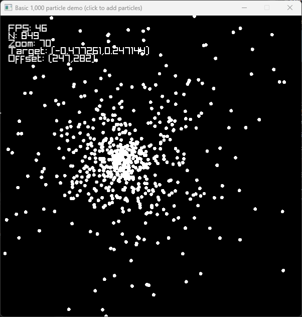

# Gravity (*n*-body) simulation

My goal is to have a performant real-time n-body simulator that works on all major platforms and that which is
reasonably, statistically accurate.

The demo shown is in the `/demo` directory.

You may need a C\+\+20-capable compiler (but C\+\+20 modules are not in use).

## Compilers

Again, C\+\+20 support is necessary (sans modules).

* MSVC
* GCC
* LLVM Clang
* (Maybe Intel ICC)

## CPU

* x86_64
* Apple ARM
* (Maybe others. I only use portable code.)

## IDE

* Visual Studio 2022 with official CMake extension
* CLion
* None

## Dependencies

* The CMake script is instructed to download and cache Raylib automatically.
* However, Raylib 5's build dependencies must be satisfied. The Raylib developers have made a post on their repository
  documenting what to install on every platform. On Windows and macOS, I didn't need to install anything (I believe). On
  Linux, I had to install a few things.
