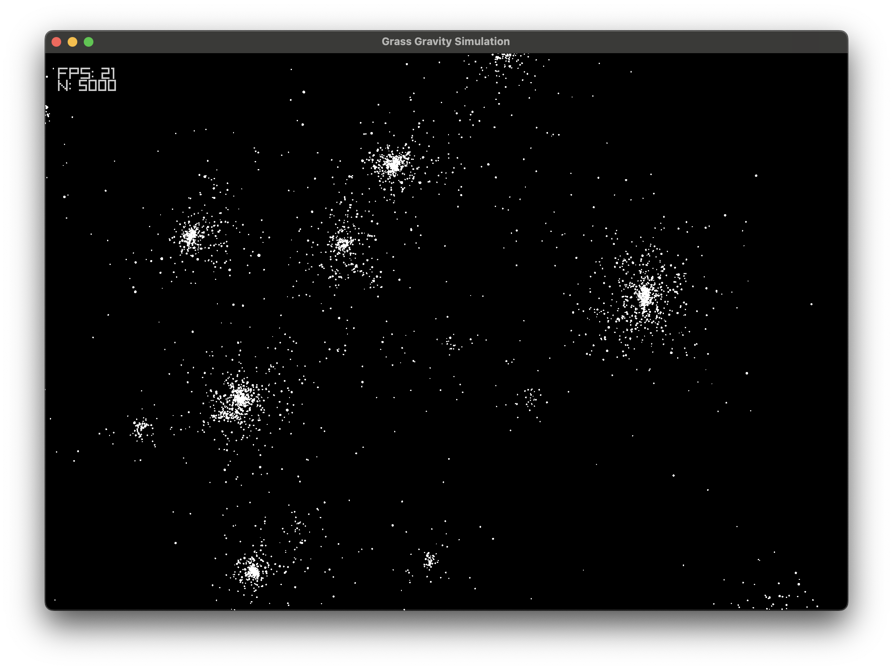

# Gravity (*n*-body) simulation

[](https://codecov.io/github/axionbuster/grass)



Real-time n-body simulator that works on all major platforms and that which is reasonably, statistically accurate.

*The project contains a fast bottom-up Barnes-Hut tree building routine.*

The demo shown is in the `/demo` directory.
Go to the `demo` folder documentation for build instructions.

You may need a C\+\+20-capable compiler (but C\+\+20 modules are not in use).

## Compilers

C\+\+20 support is necessary (sans modules).

* MSVC
* GCC
* LLVM Clang
* Intel ICC

## CPU

* x86_64
* Apple ARM

## Dependencies

* The CMake script is instructed to download and cache Raylib automatically.
* Raylib itself however requires the following dependencies on Ubuntu:
```
libasound2-dev libx11-dev libxrandr-dev libxi-dev libgl1-mesa-dev libglu1-mesa-dev libxcursor-dev libxinerama-dev
```

CMake is required for building.
