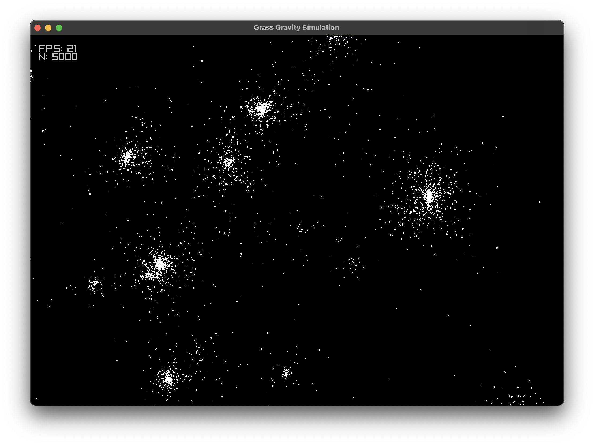

# The main demo (including "galaxies" mode)


Screenshot: Galaxies Mode

1. Build using CMake.
2. If desired, enable "galaxies" mode by running the binary with the environment variable
`GRASS_GALAXIES` set (with any value).

For example, supposing I'm in the build directory (bash):
```bash
# 1. Build (assuming Make in use; this is the usual case on Linux or macOS)
make grass

# 2. Run with optional GRASS_GALAXIES environment variable (any value;
# value is ignored as long as the key is set.)
GRASS_GALAXIES=111111 demo/grass
```

On most setups, the build directory is either called `build` or `out`, but other
choices are possible.

## What is the "galaxies" mode?

In this mode, at program startup, a random assortment of clumps of particles are generated.

## Other options to be controlled via environment variables

- `GRASS_PARTICLES_LIMIT`: If positive integer (less than or equal to 10,000), then
inclusive maximum number of particles.

## Compile for the web (alpha)


```bash
# Bash example
# At repository root

# Configure.
# (Raylib needs PLATFORM=Web.)
emcmake cmake -B build -DPLATFORM=Web

# Make grass (this application).
cmake --build build --target grass # --config RelWithDebInfo

# Serve.
python3 -m http.server 8080
```
